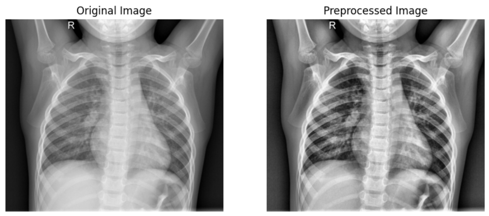
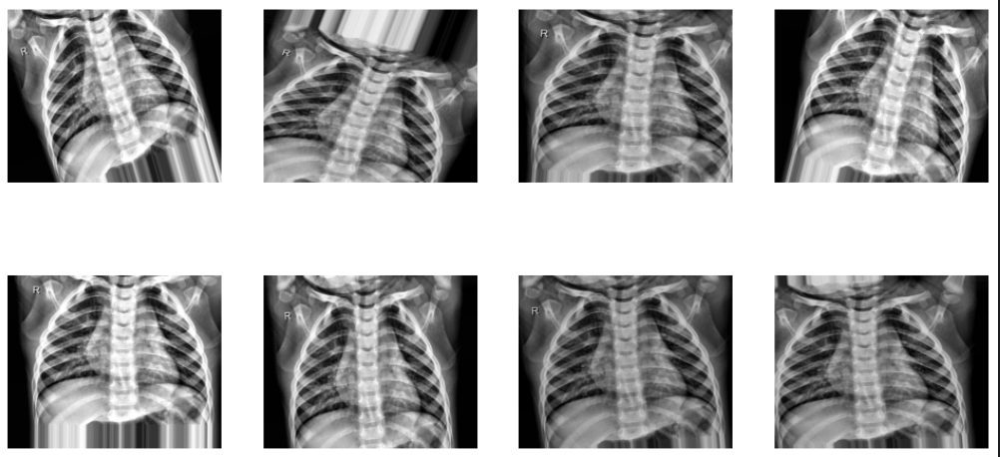
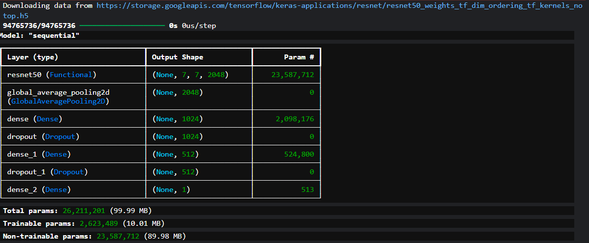
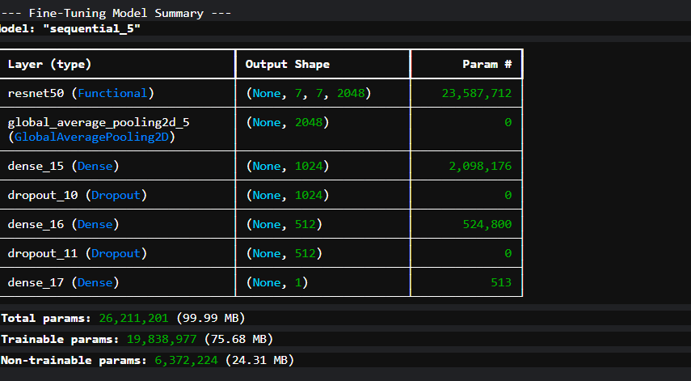
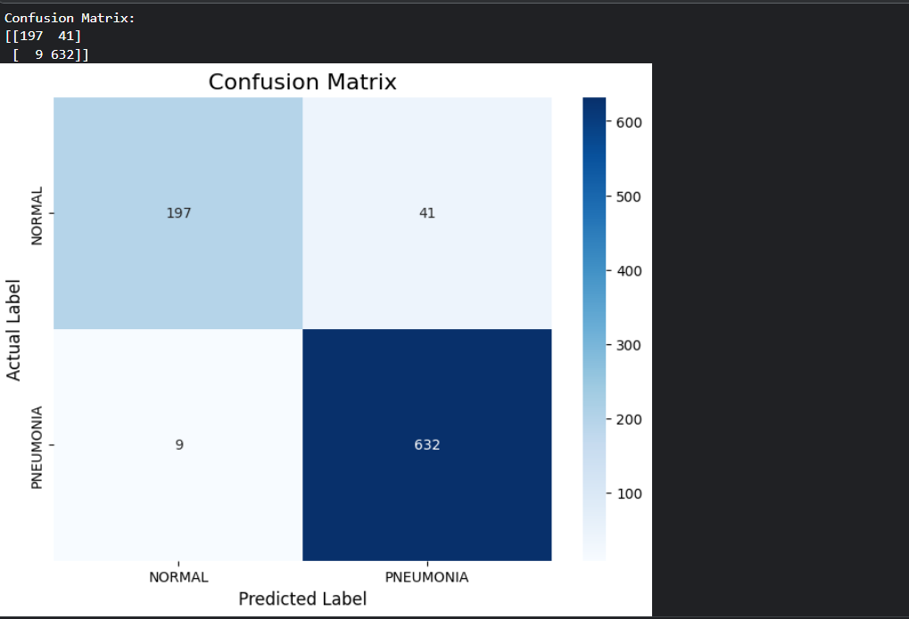
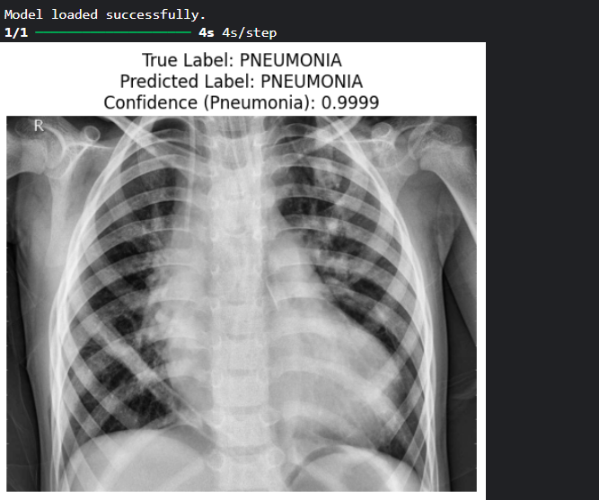

# Pneumonia Detection in Chest X-rays using Transfer Learning

This project demonstrates the development of a high-accuracy deep learning model to classify chest X-ray images as either showing signs of pneumonia or being normal. The model leverages transfer learning with the pre-trained ResNet50 architecture, achieving a **94.31% accuracy** on the unseen test set.

## Table of Contents
- [Project Overview](#project-overview)
- [Dataset](#dataset)
- [Methodology](#methodology)
- [Results](#results)
- [Example Prediction](#example-prediction)
- [How to Use](#how-to-use)
- [License](#license)

## Project Overview

The goal of this project is to build a robust Convolutional Neural Network (CNN) that can serve as a diagnostic aid for medical professionals. By training on a large dataset of X-ray images, the model learns to identify the visual patterns associated with pneumonia, providing a fast and accurate screening tool.

## Dataset

This project utilizes the **Chest X-Ray Images (Pneumonia)** dataset available on Kaggle.

- **Link:** [https://www.kaggle.com/datasets/paultimothymooney/chest-xray-pneumonia](https://www.kaggle.com/datasets/paultimothymooney/chest-xray-pneumonia)

To ensure an unbiased evaluation and robust training, the original train, validation, and test sets were merged, shuffled, and re-split into the following distribution:

| Set | Image Count | Percentage | Normal Cases | Pneumonia Cases |
| :--- | :---: | :---: | :---: | :---: |
| **Training** | 4,099 | 70.0% | 1,108 | 2,991 |
| **Validation** | 878 | 15.0% | 237 | 641 |
| **Test** | 879 | 15.0% | 238 | 641 |
| **Total** | **5,856** | **100%** | **1,583** | **4,273** |

## Methodology

The project follows a comprehensive deep learning workflow:

### 1. Image Preprocessing

All images were preprocessed to enhance features relevant for diagnosis. This involved converting images to grayscale and applying **Contrast Limited Adaptive Histogram Equalization (CLAHE)** to improve local contrast and highlight subtle details in the lung tissue.



### 2. Data Augmentation

To prevent overfitting and create a more robust model, data augmentation was applied to the training set. The model was exposed to various transformations of the original images, including rotations, shifts, shears, and zooms.



### 3. Model Architecture

A transfer learning approach was adopted using the **ResNet50** model, pre-trained on ImageNet. A powerful custom classifier head was added on top of the ResNet50 base.

#### Base Model (Feature Extraction)
The initial model used the frozen ResNet50 base as a feature extractor, with only the new classifier head being trainable.



#### Fine-Tuned Model
After the initial training phase, the top layers of the ResNet50 base (from layer 120 onwards) were unfrozen to allow for fine-tuning.



### 4. Training Strategy

A two-phase training strategy was employed for optimal performance:
- **Phase 1 (Feature Extraction):** The model with the frozen ResNet50 base was trained for 5 epochs. This allows the new classifier layers to learn basic patterns.
- **Phase 2 (Fine-Tuning):** The partially unfrozen model was then trained for an additional 60 epochs with a very low learning rate (`1e-5`) to carefully adjust the pre-trained weights to the specifics of the X-ray dataset.

Callbacks such as `EarlyStopping` and `ReduceLROnPlateau` were used to prevent overfitting and optimize the learning process. Due to the imbalanced nature of the dataset, class weights were also applied during training.

## Results

The final fine-tuned model achieved excellent performance, showing strong generalization from the training data to the unseen test set.

| Metric | Training Set | Validation Set | Test Set |
| :--- | :---: | :---: | :---: |
| **Accuracy** | 91.27% | 94.08% | 94.31% |
| **Loss** | 0.2059 | 0.1790 | 0.1801 |

### Confusion Matrix

The confusion matrix on the test set provides a deeper insight into the model's clinical value.



**Key Observations:**
- **High Recall (98.6%):** The model is extremely effective at identifying true pneumonia cases, missing only 9 out of 641 positive instances. This is critical for a medical diagnostic tool.
- **Good Precision (93.9%):** When the model predicts pneumonia, it is correct about 94% of the time.
- **Safety Bias:** The model is biased towards minimizing dangerous False Negatives, making it a reliable screening tool.

## Example Prediction

Here is an example of the model making a correct prediction on a random image from the test set with high confidence.



## How to Use

1.  **Clone the repository:**
    ```bash
    git clone https://github.com/NARDEEN-UX/Chest-X-ray-Classification-CNN.git
    ```
2.  **Install dependencies:**
    ```bash
    pip install -r requirements.txt
    ```
3.  **Download the dataset:** Download the data from the Kaggle link provided above and place it in a relevant directory.
4.  **Run the notebook:** Open and run the Jupyter Notebook located in the `/notebooks` directory to see the full process from preprocessing to evaluation. The notebook will require the path to the dataset to be updated. The final trained model is also available in the `/saved_models` directory.

## License
This project is licensed under the MIT License. See the [LICENSE](LICENSE) file for details.